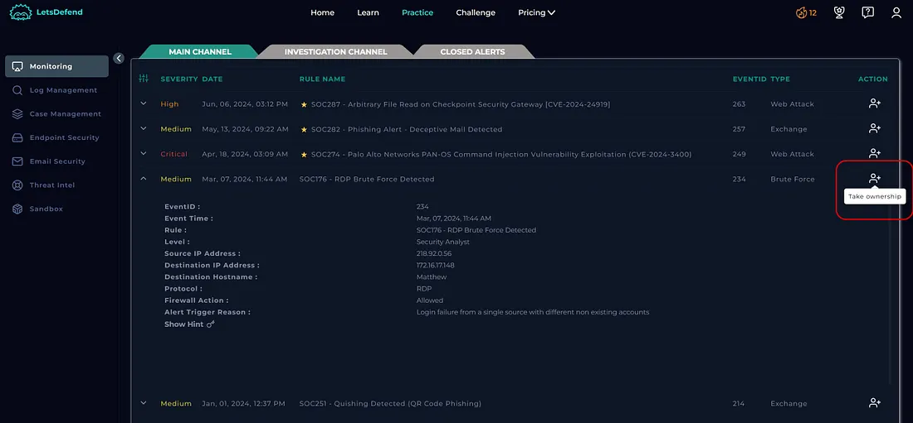
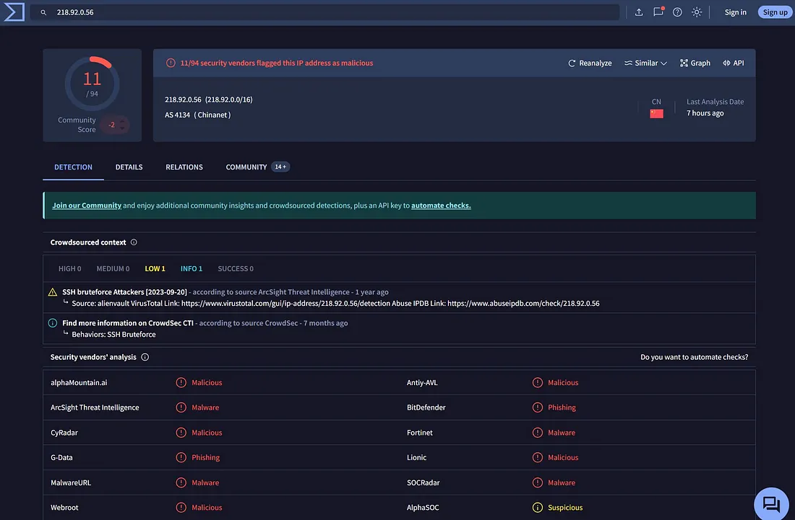
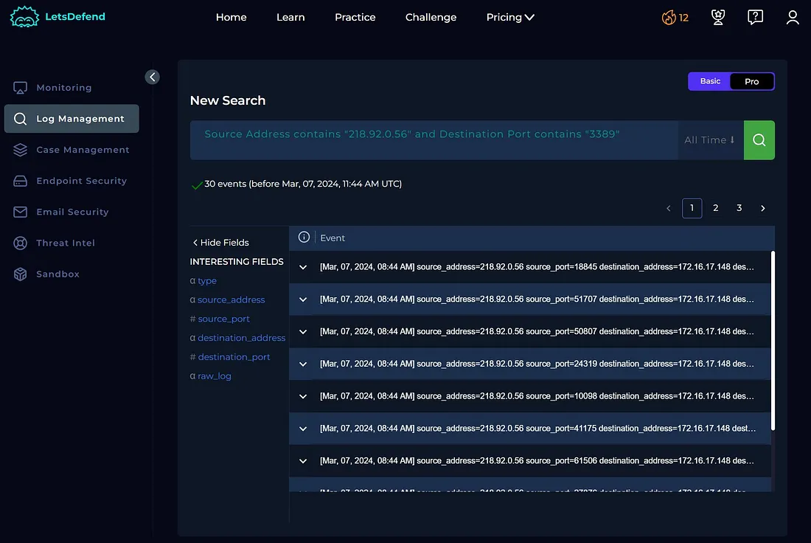
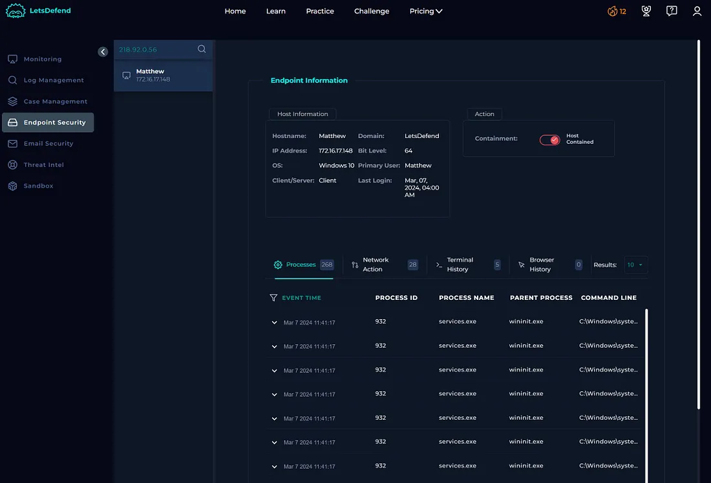

# Project Title: LetsDefend SOC Lab Walkthrough
## Lab: SOC176 RDP Brute Force Detected
## Platform : LetsDefend

### Incident Title :RDP Brute Force Detected
### Incident ID : SOC176
### Date : Feb 25 2026 
### Incident Description : 
- Unsuccefull login attempts with various non-existent accounts from a single source 


## Alert Details 
  #### Level : SOC  Analyst 
  #### Source Address : 218.92.0[.]56
  #### Destination Address : 172.16.17[.]148
  #### Affected User : Mathew
  #### Event Time: 27 Mar 2024, 11:44 AM

## Investigation Steps 
   - #### Analysis of Inital Alert Details 
      - Key Observation 
        - Observed the incoming alert details

        - Analyzed that there are 14 failed login attempts with usernames like "Admin", "guest","sysadmin" and "Matthew"
        - 1 successful login to “Matthew” at 08:44 AM, confirming a brute force attack.

   - #### External Source IP 
     - Verified that the source IP was external using the  **Endpoint Security** 

     - Confirmed that the IP address is malicious using VirusTotal ,AbuseIPDB and LetsDefend Threat Intel 


   - #### Traffic Analysis
       - Analysis of the logs revealed multiple RDP requests targeting port 3389 from the attacker’s IP address, confirming that the RDP service was the intended target.


   - #### Scope of the Attack 
       - The attacker only targeted Matthew’s machine (IP: 172.16.17[.]148), so the scope was limited to one host.

   - #### Log Management
      - 4625 (failed login): 14 attempts from the source IP.
  
      - 4624 (successful login): 1 successful login to “Matthew.”
     - This confirmed the brute force attack succeeded.
  
   - #### Containment:
The host was isolated to prevent further exploitation.
  
 ```markdown 

 ```
   
- #### Malicious Ip Address Check
    - ##### Tools used 
      - Virus Total
      - AbuseIDPB 
      - Lets Defend Threat Intel 

          
```markdown
| Field          | Information                                     |
|----------------|-------------------------------------------------|
| Alert Name     | RDP Brute Force  Attack                         |
| Alert ID       | SOC176                                          |
| Detection Tool | Virus Total, AbuseIDPB                          |
| Alert Date     | 2024-03-07                                      |
| Source IP      | 218.92.0[.]56                                   |
| Indicator      | Unsucessfull Login Attempts                     |
```


## Results  
- **Compromise Confirmed:** Log analysis revealed **14 failed login attempts** followed by a successful authentication to the "Matthew" account.
- **RDP Targeted:** The brute-force attack successfully targeted and compromised Matthew's machine via the RDP service before containment.
- **Swift Containment:** The incident response team rapidly executed the playbook, isolating the affected host and mitigating further network risk.
- **Threat Intel Match:** Threat intelligence identified the source IP (`218.92.0[.]56`) as a known malicious actor.
- **Security Gaps Identified:** The incident highlighted a critical lack of Multi-Factor Authentication (MFA) and overly permissive RDP access controls.

### Technologies Used
- RDP Log Analysis (Event Logs)
- Endpoint Isolation Tools (Containment)
- Threat Intelligence Feeds (IOC Enrichment)
- SIEM / Authentication Log Correlation
- SOC Incident Investigation Playbooks

---

## Skills Demonstrated  
* **RDP Security Investigation** & Port Monitoring
* **Brute-Force Detection** & Pattern Analysis
* **Host Isolation & Containment** Techniques
* **Indicator of Compromise (IOC)** Analysis & Enrichment
* **Authentication Log Analysis** & Timeline Correlation
* **SOC Alert Triage** & Incident Response Workflows
* **Cybersecurity Documentation** & Technical Reporting

---

## Remediation
-  **Immediate Host Isolation:** Maintain isolation of Matthew's compromised system to prevent lateral movement.
-  **Credential Revocation:** Reset passwords for the compromised "Matthew" account immediately.
-  **Enforce MFA:** Deploy Multi-Factor Authentication (MFA) across all RDP and remote access services.
-  **Network Hardening:** Restrict RDP port access (Port 3389) using firewalls or Network Access Control Lists (ACLs).
-  **Account Lockout Policies:** Implement strict account lockout thresholds to thwart automated brute-force attempts.
-  **Perimeter Blocking:** Block the malicious source IP address (`218.92.0[.]56`) at the firewall level.
-  **SIEM Alerting:** Configure real-time alerts for repeated failed login attempts, unusual RDP traffic, and authentication attempts made to non-existent accounts.


