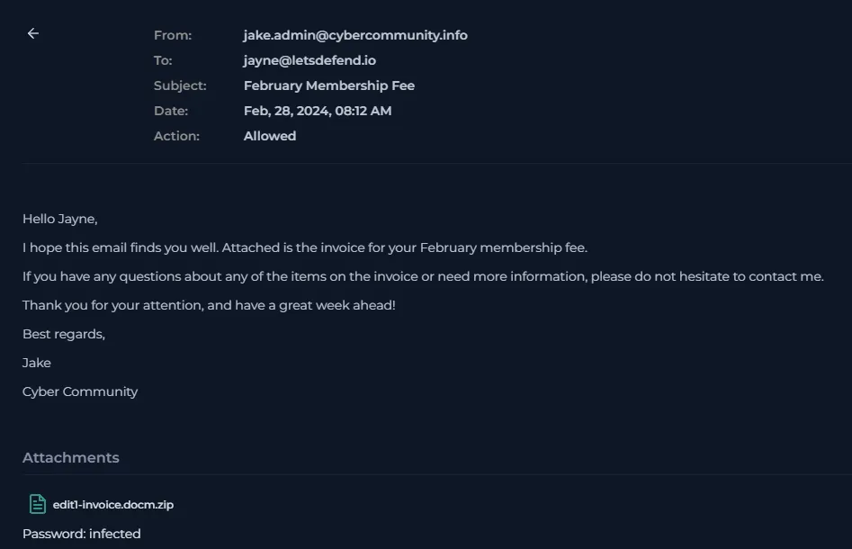
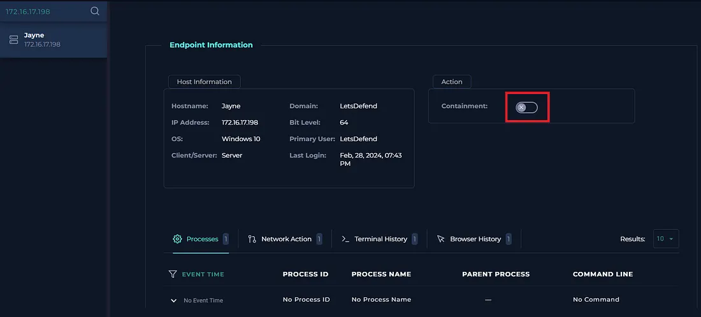

# Project Title: LetsDefend SOC Lab Walkthrough
## Lab: SOC205 — Malicious Macro has been executed
## Platform : LetsDefend

### Incident Title :Phishing Alert — Deceptive Mail Detected
### Incident ID : SOC205 Malicious Macro has been executed
### Date : Mar 24 2026 
### Incident Description : Suspicious file detected on system.
## Alert Details 
  #### Level : SOC  Analyst 
  #### Source Address : 172.16.17.198
  #### Destination Address :Felix@letsdefend.io
  #### Affected User : Jayne
  #### Event Time: 28 Feb 2024,08:42 AM

## Investigation Steps 
   - #### Analysis of Inital Alert Details 
      - Observed the incoming alert details
      
      - Analyzed the file has a extension .docm which is a macro-enabled word document.
      - Verified that the file is malicious using Virus Tools (file hash was used to detect whether it is malicious or not)
      \
      ``` 
      The document contains a macro in `ThisDocument.cls` that triggers when the InkEdit control named `GBjdshuiKJ` receives focus. The `InkEdit1_GotFocus` subroutine executes a shell command. The command to be executed is retrieved from the `TextBox1` control located on `UserForm1`. The shell command is executed with the window style set to 0, which corresponds to a hidden window. This means that upon gaining focus, the InkEdit control will execute a command retrieved from a textbox on a user form, without displaying a window.
      ```
   - #### Email analysis
     - Intial phishing email was orginated from phishingjake.admin[at]cybercommunity[.]info  and it was then sent to user Jayne
       
     - Verified that the user has accessed the phishing email.The email was later deleted from the inbox
        
   - #### Log Analysis & Timeline
      * **08:41 AM** – A `.zip` archive containing the malicious document was downloaded and placed in the `Downloads` directory.
      * **08:42 AM** – The user opened the malicious document.
      * **08:42 AM** – An embedded macro executed a PowerShell command to download a remote resource from:
      * `hxxp[:]//www[.]greyhathacker[.]net/tools/messbox[.]exe`
      * **08:42 AM** – PowerShell triggered a DNS lookup for the Command and Control (C2) host:
      * IP Address: `92.204.221[.]16`
      * **08:42 AM** – PowerShell script block execution (`Event ID 4104`) was successfully recorded in the logs.
   - #### Containment 
       - The endpoint was isolated preventing further attack from the attacker and spread of attack over the internal network
      
   - #### Observation:
   - #### Malicious Ip Address Check
        - ##### Tools used 
           - Virus Total  

```markdown
| Field          | Information                                                          |
|----------------|----------------------------------------------------------------------|
| Alert Name     |Malicious Macro has been executed                                     |
| Alert ID       |SOC205                                                                |
| Detection Tool |Virus Total ,Hybrid Analysis                                          |
| Alert Date     |2024-02-28                                                            |
| Source IP      |172.16.17.198                                                         |
| Indicator      |Suspicious file detected  on system.                                  |
```

## Results

An analysis of endpoint logs on host `Jayne` revealed a successful phishing delivery leading to a potential malware execution attempt. The attack timeline unfolded as follows:

* **08:12 AM** – **Initial Access (Phishing):** A spear-phishing email from `jake.admin[@]cybercommunity[.]info` was delivered to user `Jayne`, containing a malicious attachment named `edit1-invoice.docm`.
* **08:42 AM** – **Execution (Malicious Macro):** The user opened the document, triggering an embedded macro that spawned a PowerShell process.
* **08:42 AM** – **Command and Control / Delivery:** PowerShell initiated a DNS lookup and attempted to download a remote malicious executable (`messbox.exe`) from the external domain:
  * **URL:** `hxxp[:]//www[.]greyhathacker[.]net/tools/messbox[.]exe`
  * **C2 IP:** `92.204.221[.]16`
* **08:42 AM** – **Detection:** The malicious activity, including the network connection and PowerShell script block execution, was successfully logged by the system's security monitoring agents.

## Technologies Used

* **SIEM / Log Viewer:** For aggregating, parsing, and analyzing endpoint events.
* **Sysmon (System Monitor):** Extensively utilized for tracking process creation, network connections, and script execution behaviors.
* **Windows Event Logs:** Focused on PowerShell Operational logs (**Event ID 4104** for Script Block Execution).
* **Defanging Tools:** Used to neutralize Indicators of Compromise (IOCs) for safe documentation.

## Skills Demonstrated

* **Incident Response & Triage:** Efficiently reconstructed an attack timeline from initial email delivery to the final download attempt.
* **Log Analysis & Forensic Investigation:** Analyzed Windows Event Logs and Sysmon data to track process lineage (Word -> PowerShell) and network activity.
* **Threat Identification:** Identified and isolated Indicators of Compromise (IOCs) including malicious IPs, domains, files, and email addresses.
* **Defanging & Threat Intelligence Reporting:** Followed industry best practices to safely document malicious assets without creating live links.

## Remediation

The following immediate and long-term actions were identified to contain the threat and prevent future occurrences:

1. **Host Isolation:** Immediate network isolation of host `Jayne` (`172.16.17.198`) to prevent potential lateral movement or further C2 communication.
2. **Artifact Preservation:** Documented and preserved the `edit1-invoice.docm` file, PowerShell history, and memory dumps for deeper forensic analysis/sandboxing.
3. **IOC Blocking:** Added `92.204.221[.]16` and `www[.]greyhathacker[.]net` to the corporate firewall and proxy blocklists.
4. **Credential Revocation:** Initiated a mandatory password reset for the user account associated with host `Jayne`.
5. **Email Security Tuning:** Flagged the sender address `jake.admin[@]cybercommunity[.]info` at the email gateway and updated spam/phishing filters to catch similar inbound campaigns.