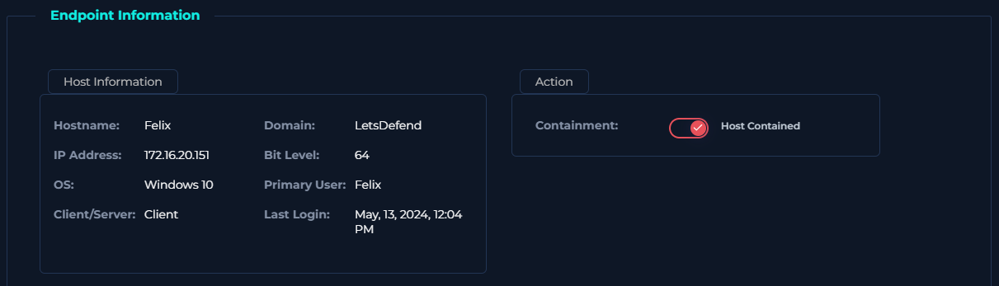

# Project Title: LetsDefend SOC Lab Walkthrough
## Lab: SOC282 — Phishing Alert — Deceptive Mail Detected
## Platform : LetsDefend

### Incident Title :Phishing Alert — Deceptive Mail Detected
### Incident ID : SOC282 Phishing Alert — Deceptive Mail Detected
### Date : Mar 24 2026 
### Incident Description : 
A suspicious link has been detected in an email sent to "Felix" from the email address “free@coffeeshoop.com” with the SMTP IP address 103.80.134[.]63.
## Alert Details 
  #### Level : SOC  Analyst 
  #### Source Address : free@coffeeshoop.com
  #### Destination Address :Felix@letsdefend.io
  #### Affected User : Felix
  #### Event Time: 13 May 2024,09:22 AM

## Investigation Steps 
   - #### Analysis of Inital Alert Details 
      - Observed the incoming alert details
      
      - A suspicious link was identified in an email sent to “Felix” from the address “free@coffeeshoop.com,” originating from the SMTP IP address 103.80.134[.]63.
      
      - Analyzed that the phishing email has a file attached
      
   - #### Source IP and Attachment Verification 
     - A Deailed Analysis was done on the source ip and the attachement with folllowing observations
      Found a reference to a WMI query string known to be used for VM detection.
     - Possibly checks for the presence of a forensics/monitoring tool.
     - Contacts 1 host (37.120.233.226 | Port 3451/TCP | Origin: Romania)
     - PID: 7508
     - Hash: 6f33ae4bf134c49faa14517a275c039ca1818b24fc2304649869e399ab2fb389 | SHA256
     - Associated URL: hxxps://files-ld.s3.us-east-2.amazonaws.com/59cbd215–76ea-434d-93ca-4d6aec3bac98-free-coffee.zip
     - AsyncRAT | AsyncRAT is a RAT that can monitor and remotely control infected systems. This malware was introduced on GitHub as a legitimate open-source remote administration software, but hackers use it for its many powerful malicious functions.
         
   - #### User Action Review 
       - Verified that the user has accessed the phishing email.The email was later deleted from the inbox
       
   - #### Containment 
       - The endpoint was isolated preventing further attack from the attacker and spread of attack over the internal network
      
   - #### Observation:
   - #### Malicious Ip Address Check
        - ##### Tools used 
           - Virus Total  
```markdown
| Field          | Information                                                          |
|----------------|----------------------------------------------------------------------|
| Alert Name     |Phishing Alert — Deceptive Mail Detected                              |
| Alert ID       |SOC282                                                                |
| Detection Tool |Virus Total ,Hybrid Analysis                                          |
| Alert Date     |2024-09-17                                                            |
| Source IP      |103.80.134[.]63                                                       |
| Indicator      |An SMPTP transaction                                                 |
```

## Results
- Identified a phishing email sent from free@coffeeshooop.com originating from SMTP IP 103.80.134.63.
- Determined that the phishing email targeted the user Felix@letsdefend.io and contained a malicious ZIP attachment disguised as a free coffee voucher.
- Analyzed the malicious attachment and confirmed that it contained a harmful URL used to compromise the victim host system.
- Detected attacker activities related to persistence and privilege escalation after initial system access.
- Contained the affected host system (172.16.20.151) to prevent further compromise and lateral movement.
- Escalated the incident to the Tier 2 SOC Analyst team for further investigation and incident response handling.
- Investigated alert associated with EventID=257 and correlated indicators of compromise (IOCs) with the phishing activity.

## Technologies Used
- SIEM Platform for Alert Monitoring and Investigation
- Email Security Analysis Tools
- Endpoint Detection and Response (EDR)
- Log Analysis and Event Monitoring
- Malware Analysis Techniques
- Threat Intelligence and IOC Correlation
- SMTP and Email Header Investigation
- Windows Event Monitoring (EventID=257)


## Skills Demonstrated
- Phishing Email Analysis
- Incident Investigation and Triage
- Malware and Malicious URL Analysis
- Threat Detection and IOC Identification
- Log Analysis and Event Correlation
- Persistence and Privilege Escalation Detection
- Endpoint Containment Procedures
- SOC Escalation Workflow Handling
- Cybersecurity Incident Documentation
- Email Threat Analysis

## Remediation
- Educated employees on identifying and reporting suspicious phishing emails and malicious attachments.
- Reset compromised user credentials and enforced strong password policies.
- Contained the compromised host system to stop further attacker activity.
- Recommended implementing email authentication mechanisms such as SPF, DKIM, and DMARC to reduce spoofed email attacks.
- Improved email filtering and attachment scanning to detect malicious ZIP files and URLs.
- Recommended regular cybersecurity awareness training for employees.
- Suggested continuous monitoring for persistence mechanisms and privilege escalation attempts across endpoints.