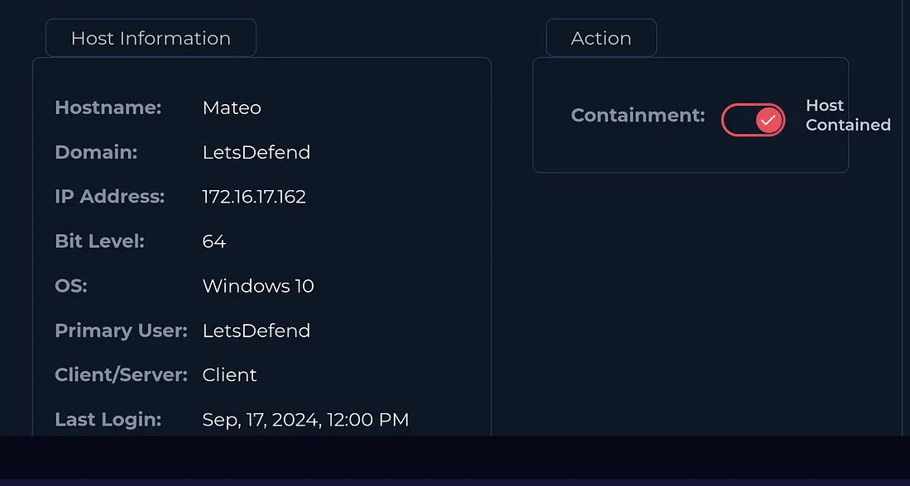

# Project Title: LetsDefend SOC Lab Walkthrough
## Lab: SOC326 — Impersonating Domain MX Record Change Detected
## Platform : LetsDefend

### Incident Title :Impersonating Domain MX Record Change Detected
### Incident ID : SOC326
### Date : Mar 21 2026 
### Incident Description : 
On September 17, 2024, an alert was triggered by a Digital Risk Protection system indicating that the MX record of a suspicious domain resembling the organization’s brand had changed. The domain in question was letsdefwnd[.]io — a classic typosquatting variation of the legitimate domain.

## Alert Details 
  #### Level : SOC  Analyst 
  #### Source Address : noreply@cti-report.io
  #### Destination Address :soc@letsdefend.io
  #### Affected User : Mateo
  #### Event Time: 17 Sep 2024,12:05 PM

## Investigation Steps 
   - #### Analysis of Inital Alert Details 
      - Observed the incoming alert details
      
      - Analyzed that Firewall logs showed and SMTP transaction at 12:05 PM from source IP Address 45.33.23.183 to internal server  over port 25
      
      
   - #### Source IP Verification 
      - Verified source IP adress was involved in phishing-related activity further increasing the confidence level of the art 
           
   - #### Log  Analysis Review 
       - Log analysis has confirmed that the  user has accessed the link contained in the phishing email
       
   - #### Containment 
       - The endpoint was isolated preventing further attack from the attacker and spread of attack over the internal network
      
   - #### Observation:
   - #### Malicious Ip Address Check
        - ##### Tools used 
           - Virus Total  
```markdown
| Field          | Information                                          |
|----------------|------------------------------------------------------|
| Alert Name     |Impersonating Domain MX Record Change Detected        |
| Alert ID       | SOC326                                               |
| Detection Tool | Virus Total                                          |
| Alert Date     | 2024-09-17                                           |
| Source IP      | 45.33.23.183                                         |
| Indicator      | An SMPTP transaction                                 |
```

## Results
- Phishing email successfully bypassed initial user suspicion due to a lookalike domain and deceptive MX record changes.
- User interaction with the phishing email increased the overall risk exposure.
- Security team identified suspicious activity through log analysis and domain investigation.
- Correlation of email logs, authentication logs, and user activity enabled rapid incident validation and containment.
- Timely response actions prevented confirmed account compromise or data exfiltration.

## Technologies Used
- Email Security Gateway
- SIEM Platform
- DNS & MX Record Analysis
- Endpoint Detection and Response (EDR)
- Threat Intelligence Feeds
- Multi-Factor Authentication (MFA)
- Log Management and Correlation Tools

## Skills Demonstrated
- Phishing Analysis
- Threat Detection and Investigation
- Log Correlation
- Incident Response
- User Behavior Analysis
- Email Header Analysis
- Threat Intelligence Validation
- Domain Reputation Analysis
- Rapid Containment Procedures
- Security Monitoring

## Remediation
- Blocked the malicious domain and associated IP addresses across security controls.
- Reset affected user credentials and enforced MFA verification.
- Conducted phishing awareness communication for users.
- Enhanced email filtering rules to detect lookalike domains and suspicious MX changes.
- Monitored authentication logs for additional suspicious activity.
- Strengthened phishing incident response procedures.
- Added identified Indicators of Compromise (IOCs) to SIEM and monitoring systems.